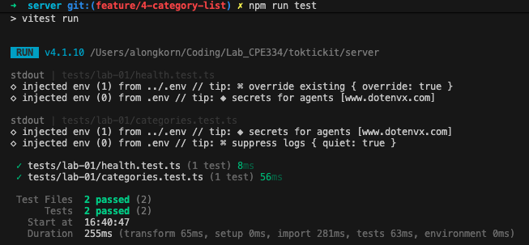
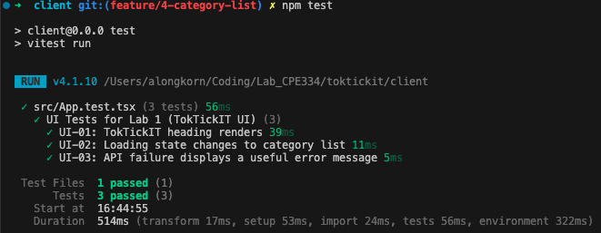

# Lab 1 Automated Tests Result

All automated tests for Lab 1 are executed using Vitest and Supertest (`npm test`).

## Test Execution Summary

| Test ID | Tool | Test Description | Test File Location | Status |
| :--- | :--- | :--- | :--- | :--- |
| **API-01** | Supertest | Health endpoint returns 200 and expected JSON | `server/tests/lab-01/health.test.ts` | **PASSED** |
| **API-02** | Supertest | Categories endpoint returns the four seeded categories | `server/tests/lab-01/categories.test.ts` | **PASSED** |
| **UI-01** | Vitest | TokTickIT heading renders | `client/src/App.test.tsx` | **PASSED** |
| **UI-02** | Vitest | Loading state changes to category list | `client/src/App.test.tsx` | **PASSED** |
| **UI-03** | Vitest | API failure displays a useful error message | `client/src/App.test.tsx` | **PASSED** |

---

### Command Output (`npm test`)

```text
> test
> npm run test:server && npm run test:client

> test:server
> npm --prefix server run test

 RUN  v4.1.10 /Users/alongkorn/Coding/Lab_CPE334/toktickit/server
 ✓ tests/lab-01/health.test.ts (1 test) 8ms
 ✓ tests/lab-01/categories.test.ts (1 test) 56ms

 Test Files  2 passed (2)
      Tests  2 passed (2)

> test:client
> npm --prefix client run test

 RUN  v4.1.10 /Users/alongkorn/Coding/Lab_CPE334/toktickit/client
 ✓ src/App.test.tsx (3 tests) 56ms

 Test Files  1 passed (1)
      Tests  3 passed (3)
```

---

### Test Execution Screenshots

#### 1. Server API Test Result (`npm run test:server`)


#### 2. Client UI Test Result (`npm run test:client`)
